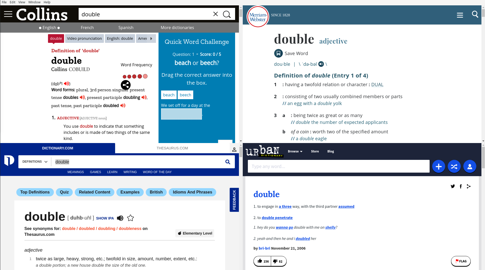

# modify for 4 dict

 - npm install 
 - ./node_modules/electron/dist/electron src/index.js double

# Example ElectronJS Hybrid App

This is an example app that uses `BrowserView` to remotely load contents into an ElectronJS window. Submitting the form sends an event via IPC, which the main process listens for, then sends a new event with the greeting. `preload.js` listens for the greeting event and renders the greeting beneath the form.

Start via `npm start`.

See [this blog post](https://smilesql.com/blog/hybrid-electron-app-example/) for more background.
